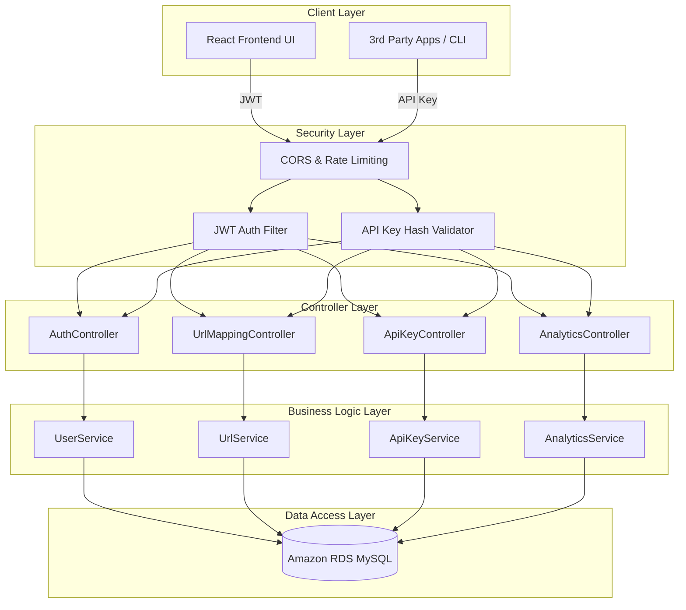
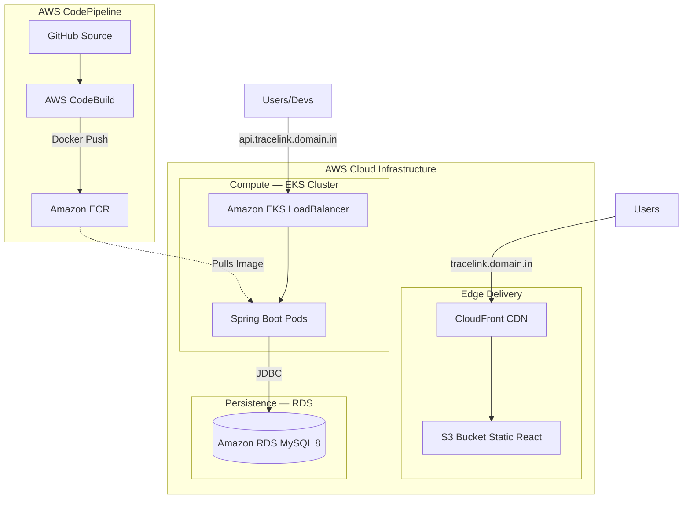

<div align="center">

# 🔗 TraceLink

### Advanced URL Shortening, Analytics & Developer Platform

A full-stack, production-ready **URL shortening and analytics platform** designed with a focus on enterprise-grade security, comprehensive developer tooling, and modern DevOps deployment practices.

[](https://openjdk.org/)
[](https://spring.io/projects/spring-boot)
[](https://reactjs.org/)
[](https://mysql.com/)
[](https://docker.com/)
[](https://aws.amazon.com/)

[Features](#features) · [Architecture](#architecture) · [API Reference](#api-reference) · [Getting Started](#getting-started) · [Deployment](#deployment)

</div>

---

## Overview

**TraceLink** is a scalable, cloud-native URL management platform built with a **Spring Boot** backend and a **React** frontend. It demonstrates end-to-end enterprise development and DevOps practices, including dual authentication (JWT + BCrypt-hashed API keys), real-time traffic analytics, and a fully automated AWS infrastructure deployment via Docker, EKS, RDS, S3, and CodePipeline.

---

## Features

### Link Management & Analytics
- **Custom URL Shortening:** Generate concise, shareable links with custom aliases.
- **Dynamic QR Codes:** Automatically generate downloadable QR codes (SVG/PNG) for every link.
- **Real-Time Analytics:** Track total clicks, referrers, and daily traffic trends.
- **Device & Geography Tracking:** Advanced User-Agent parsing to track visitor OS, Browser, and Device types.

### Developer API Platform
- **Programmatic Access:** Comprehensive REST API for creating and managing links.
- **Secure API Keys:** Generate, mask, and manage API keys via a dedicated developer dashboard.
- **Enterprise Security:** API keys are secured using an `O(1)` deterministic prefix lookup paired with rigorous **BCrypt hashing**.
- **Bearer Authentication:** Seamless integration for developers using standard `Authorization: Bearer <API_KEY>` headers.

### Authentication & User Security
- **Stateless JWT Authentication** alongside Developer API Keys.
- **Role-Based Access Control (RBAC)** to isolate user data.
- **User Dashboard:** Update profiles, manage URLs, and securely revoke active sessions or API keys.

---

## Architecture

### System Overview



---

### AWS Infrastructure Pipeline



---

## Technology Stack

### Backend
- **Core:** Java 21 LTS, Spring Boot 3
- **Security:** Spring Security, JWT (JJWT), BCrypt
- **Persistence:** Spring Data JPA, Hibernate, MySQL 8
- **Tools:** Maven, Lombok, Yauaa (User-Agent parsing)

### Frontend
- **Core:** React 18, Vite
- **Routing & State:** React Router DOM, React Context
- **Styling:** Vanilla CSS, Framer Motion (Animations)
- **Data Visualization:** Recharts
- **Forms & Validation:** React Hook Form, React Hot Toast

### DevOps & Infrastructure
- **Containerization:** Docker (Multi-stage builds)
- **AWS Compute:** Amazon EKS, ECR
- **AWS Data & Edge:** Amazon RDS, S3, CloudFront
- **CI/CD:** AWS CodePipeline, CodeBuild

---

## API Reference

**Base URL:** `https://api.tracelink.yourdomain.com/api`

### Links & Redirects
| Method | Endpoint | Description | Auth Required |
|--------|----------|-------------|---------------|
| `POST` | `/urls/shorten` | Create a new short URL | JWT / API Key |
| `GET`  | `/urls/myurls` | List all URLs for the user | JWT / API Key |
| `GET`  | `/{shortUrl}` | Redirect to original URL | None |
| `GET`  | `/url/qr/{shortUrl}` | Generate QR code (SVG/PNG) | None |

### Analytics
| Method | Endpoint | Description | Auth Required |
|--------|----------|-------------|---------------|
| `GET`  | `/analytics/{shortUrl}` | Get detailed analytics for a URL | JWT / API Key |
| `GET`  | `/analytics/total` | Get aggregated account analytics | JWT / API Key |

### Developer Platform
| Method | Endpoint | Description | Auth Required |
|--------|----------|-------------|---------------|
| `POST` | `/keys` | Generate a new developer API key | JWT |
| `GET`  | `/keys` | List active API keys | JWT |
| `DELETE`| `/keys/{id}` | Revoke an API key | JWT |

---

## Getting Started

### Local Development Setup

**1. Clone the repository**
```bash
git clone https://github.com/BenGJ10/TraceLink.git
cd TraceLink
```

**2. Database Configuration**
Create a MySQL database named `url_shortner_db`.
Copy the local environment profile and configure your database credentials:
```bash
cp src/main/resources/application-dev.properties.example src/main/resources/application-dev.properties
```

**3. Run the Backend**
```bash
export SPRING_PROFILES_ACTIVE=dev
./mvnw spring-boot:run
```
*Backend runs on `http://localhost:8080`*

**4. Run the Frontend**
```bash
cd frontend
cp .env.local.example .env.local # Ensure VITE_API_BASE_URL=http://localhost:8080
npm install
npm run dev
```
*Frontend runs on `http://localhost:5173`*

---

## Docker & Cloud Deployment

### Dockerized Local Execution
TraceLink uses a heavily optimized, multi-stage `Dockerfile`. You can run the entire stack locally via Docker:

```bash
docker build -t tracelink-backend .

docker run -p 8080:8080 \
  -e SPRING_PROFILES_ACTIVE=prod \
  -e DB_URL=jdbc:mysql://host.docker.internal:3306/url_shortner_db \
  -e DB_USER=your_user \
  -e DB_PASS=your_password \
  -e JWT_SECRET=your_256_bit_secret \
  tracelink-backend
```

### AWS Production Deployment
TraceLink is designed to be deployed to an enterprise-grade AWS environment:

1. **Frontend:** Built via CodeBuild and synced to an **S3 Bucket**, served globally via **CloudFront**.

2. **Backend:** Packaged into a Docker container, pushed to **Amazon ECR**, and orchestrated via **Amazon EKS** behind an AWS LoadBalancer.

3. **Database:** Connected to a private **Amazon RDS** MySQL instance.

4. **Networking:** Custom domains mapped via **Route 53** with SSL/TLS provided by **AWS Certificate Manager (ACM)**.

---

## Contributing
Contributions are welcome! Please feel free to submit a Pull Request.

## License
This project is licensed under the MIT License.

---
<div align="center">
  <sub>Built with ☕ using Spring Boot & React</sub>
</div>