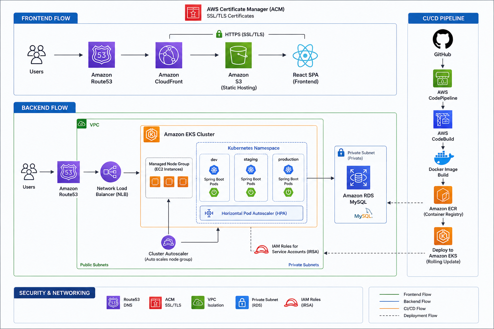
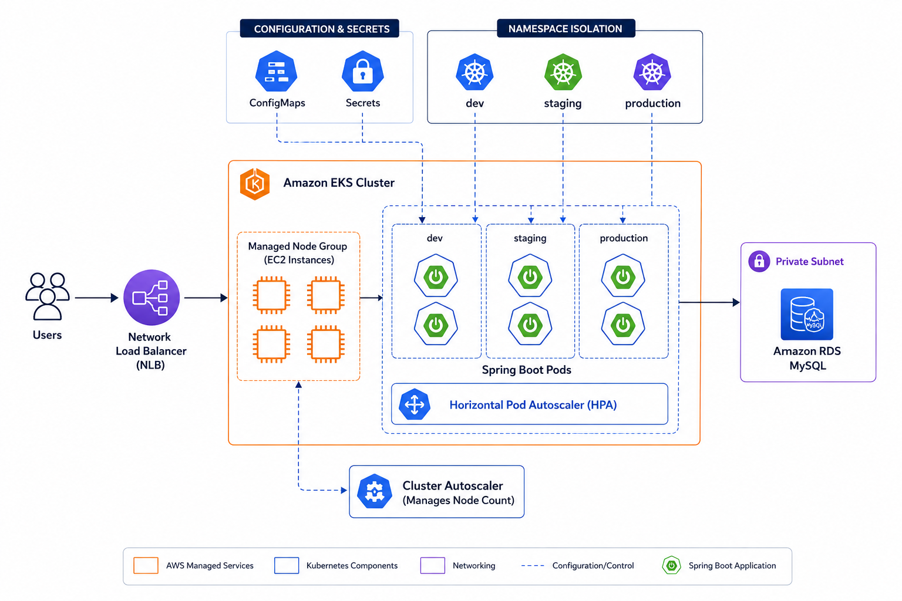
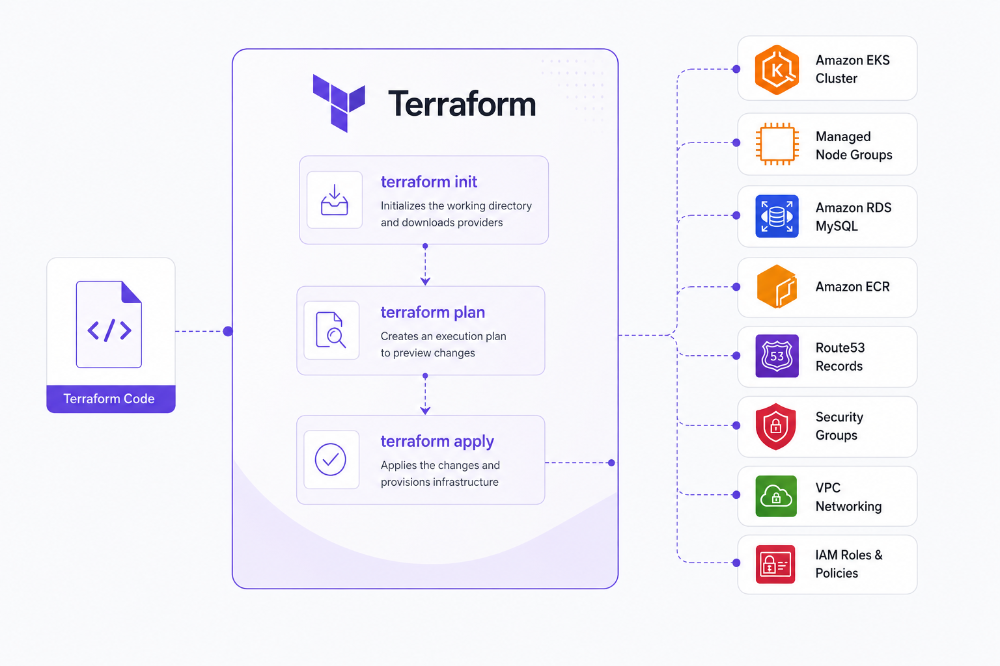
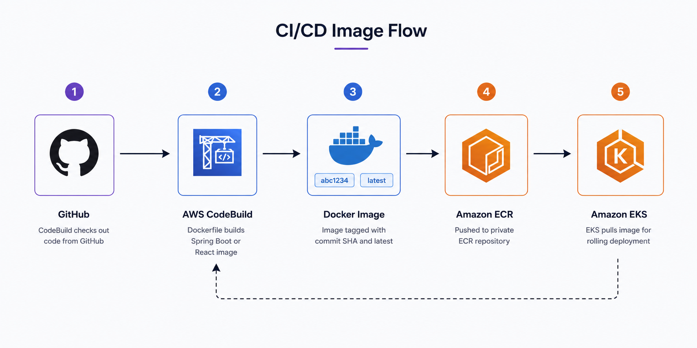

<div align="center">

# 🔗 TraceLink

### Advanced URL Shortening, Analytics & Developer Platform

A full-stack, production-ready **URL shortening and analytics platform** built with enterprise-grade security, a comprehensive developer API, and a fully automated AWS cloud deployment pipeline.

[](https://openjdk.org/)
[](https://spring.io/projects/spring-boot)
[](https://reactjs.org/)
[](https://mysql.com/)
[](https://docker.com/)
[](https://kubernetes.io/)
[](https://aws.amazon.com/)
[](https://www.terraform.io/)

[Features](#-features) · [Architecture](#-architecture) · [API Reference](#-api-reference) · [Getting Started](#-getting-started) · [Deployment](#-deployment)

</div>

---

## Overview

**TraceLink** is a scalable, cloud-native URL management platform built with a **Spring Boot 4** backend and a **React 19** frontend. It demonstrates end-to-end enterprise development and DevOps practices — dual authentication (JWT + BCrypt-hashed API keys), real-time traffic analytics, password recovery via email (Gmail SMTP), and a fully automated CI/CD pipeline deploying to AWS EKS through CodePipeline and CodeBuild.

---

## Features

### Link Management & Analytics
- **Custom URL Shortening:** Generate concise, shareable links instantly.
- **Dynamic QR Codes:** Auto-generate downloadable QR codes (SVG/PNG) for every link.
- **Real-Time Analytics:** Track total clicks, referrers, devices, and daily traffic trends with interactive charts.
- **Device & Geography Tracking:** Advanced User-Agent parsing (Yauaa) to capture visitor OS, browser, and device type.
- **Link Controls:** Enable/disable individual links, set expiry, and track UTM parameters.

### Developer API Platform
- **Programmatic Access:** Full REST API for creating and managing links from any application.
- **Secure API Keys:** Generate, mask, and revoke API keys from a dedicated developer dashboard.
- **Enterprise Key Security:** Keys secured using `O(1)` deterministic prefix lookup + BCrypt hashing — raw key is never stored.
- **Bearer Authentication:** Standard `Authorization: Bearer <API_KEY>` header support.

### Authentication & User Security
- **Stateless JWT Authentication** alongside Developer API Keys — two separate auth flows in one system.
- **Forgot Password / Reset Password:** Secure email-based password recovery with time-limited tokens (Gmail SMTP / Spring Mail).
- **Role-Based Access Control (RBAC):** Complete user data isolation — users can only access their own links.
- **BCrypt Password Hashing:** All user passwords hashed with BCrypt before persistence.

### Platform Pages
- **Landing Page, Blog, About, Support, Contact Sales** — complete public-facing site.
- **Contact Sales form** wired to the backend: sends a real email notification to the team.

---

## Architecture

### Application Architecture



---

### Kubernetes Architecture



```
k8s/
├── namespace.yaml      — Isolated namespace: tracelink
├── configmap.yaml      — Non-sensitive config (DB_URL, FRONTEND_URL, etc.)
├── secret.yaml         — Sensitive secrets (DB_PASS, JWT_SECRET, MAIL_PASSWORD)
├── deployment.yaml     — 2 replicas, zero-downtime RollingUpdate, health probes
├── service.yaml        — AWS NLB LoadBalancer (port 80 → 8080)
└── hpa.yaml            — Auto-scales on CPU (70%) + Memory (80%)
```

---

## Technology Stack

### Backend
| Technology | Purpose |
|---|---|
| Java 21 LTS | Core runtime |
| Spring Boot 4.0 | Application framework |
| Spring Security + JWT (JJWT) | Stateless authentication |
| Spring Data JPA + Hibernate | ORM & data access |
| Spring Mail | Email delivery (Gmail SMTP) |
| MySQL 8 | Relational database |
| Maven | Build tool |
| Lombok | Boilerplate reduction |
| Yauaa | User-Agent analytics parsing |

### Frontend
| Technology | Purpose |
|---|---|
| React 19 + Vite | UI framework & build tool |
| React Router DOM v7 | Client-side routing |
| React Hook Form | Form handling & validation |
| Recharts | Analytics data visualization |
| Axios | HTTP client |
| React Hot Toast | Notification system |
| Vanilla CSS | Styling (no framework) |

### DevOps & Infrastructure
| Technology | Purpose |
|---|---|
| Docker (multi-stage) | Containerization |
| Amazon EKS | Kubernetes orchestration |
| Amazon ECR | Container image registry |
| Amazon RDS (MySQL 8) | Managed relational database |
| Amazon S3 + CloudFront | Static frontend hosting + CDN |
| AWS CodePipeline + CodeBuild | CI/CD automation |
| Route 53 + ACM | DNS + SSL/TLS certificates |
| Terraform | Infrastructure as Code (RDS, ECR, EKS) |

---

## 📡 API Reference

**Base URL (Production):** `https://tl.bengregoryjohn.in/api`

### Authentication Endpoints
| Method | Endpoint | Description | Auth |
|--------|----------|-------------|------|
| `POST` | `/auth/public/login` | Login with username & password | None |
| `POST` | `/auth/public/register` | Register a new user account | None |
| `POST` | `/auth/public/forgot-password` | Send password reset email | None |
| `POST` | `/auth/public/reset-password` | Reset password with token | None |
| `POST` | `/auth/public/contact` | Submit a contact sales inquiry | None |

### Links & Redirects
| Method | Endpoint | Description | Auth |
|--------|----------|-------------|------|
| `POST` | `/urls/shorten` | Create a new short URL | JWT / API Key |
| `GET` | `/urls/myurls` | List all links for the user | JWT / API Key |
| `PATCH` | `/urls/{shortUrl}/toggle` | Enable or disable a link | JWT / API Key |
| `DELETE` | `/urls/{shortUrl}` | Delete a link permanently | JWT / API Key |
| `GET` | `/{shortUrl}` | Redirect to original URL | None |
| `GET` | `/api/url/qr/{shortUrl}` | Generate QR code (SVG/PNG) | None |

### Analytics
| Method | Endpoint | Description | Auth |
|--------|----------|-------------|------|
| `GET` | `/analytics/{shortUrl}` | Detailed analytics for a link | JWT / API Key |
| `GET` | `/analytics/total` | Aggregated account analytics | JWT / API Key |

### Developer API Keys
| Method | Endpoint | Description | Auth |
|--------|----------|-------------|------|
| `POST` | `/keys` | Generate a new API key | JWT |
| `GET` | `/keys` | List all active API keys | JWT |
| `DELETE` | `/keys/{id}` | Revoke an API key | JWT |

---

## Getting Started

### Local Development

**1. Clone the repository**
```bash
git clone https://github.com/BenGJ10/TraceLink.git
cd TraceLink
```

**2. Configure the backend**

Create a local properties file and fill in your MySQL credentials and Gmail App Password:
```bash
# File: src/main/resources/application-dev.properties
spring.datasource.url=jdbc:mysql://localhost:3306/url_shortner_db
spring.datasource.username=YOUR_DB_USER
spring.datasource.password=YOUR_DB_PASS
jwt.secret=YOUR_256_BIT_SECRET
frontend.url=http://localhost:5173

# Gmail SMTP — generate an App Password at myaccount.google.com/apppasswords
spring.mail.host=smtp.gmail.com
spring.mail.port=587
spring.mail.username=YOUR_GMAIL
spring.mail.password=YOUR_APP_PASSWORD
```

**3. Run the backend**
```bash
./mvnw spring-boot:run -Dspring-boot.run.profiles=dev
# Runs on http://localhost:8080
```

**4. Run the frontend**
```bash
cd tracelink-frontend
npm install
npm run dev
# Runs on http://localhost:5173
```

---

## Docker

Build and run the backend with Docker:

```bash
# Build (amd64 — required for EKS)
docker build --platform linux/amd64 -t tracelink-backend .

# Run locally
docker run -p 8080:8080 \
  -e SPRING_PROFILES_ACTIVE=prod \
  -e DB_URL=jdbc:mysql://host.docker.internal:3306/url_shortner_db \
  -e DB_USER=root \
  -e DB_PASS=yourpassword \
  -e JWT_SECRET=your_256_bit_secret \
  -e JWT_EXPIRATION_MS=172800000 \
  -e FRONTEND_URL=http://localhost:5173 \
  -e BASE_URL=http://localhost:8080 \
  -e MAIL_USERNAME=youremail@gmail.com \
  -e MAIL_PASSWORD=your_app_password \
  -e CONTACT_EMAIL=youremail@gmail.com \
  tracelink-backend
```

---

## Deployment

### Infrastructure (Terraform)

All AWS infrastructure is provisioned via Terraform under `terraform/`:



Provisions: **RDS, ECR, EKS Cluster, Node Group, OIDC Provider**

### Kubernetes

After EKS is up:
```bash
aws eks update-kubeconfig --region ap-south-1 --name tracelink-cluster

kubectl apply -f k8s/namespace.yaml
kubectl apply -f k8s/configmap.yaml
kubectl apply -f k8s/secret.yaml
kubectl apply -f k8s/deployment.yaml
kubectl apply -f k8s/service.yaml
kubectl apply -f k8s/hpa.yaml
```

### CI/CD Pipeline

Every `git push` to `main` automatically triggers:



### Frontend

```bash
cd tracelink-frontend/
npm run build
aws s3 sync dist/ s3://tracelink-frontend-prod --delete
aws cloudfront create-invalidation --distribution-id <ID> --paths "/*"
```

---

## Contributing
Contributions are welcome! Please feel free to submit a Pull Request.

## License
This project is licensed under the MIT License.

---
<div align="center">
  <sub>Built with ☕ using Spring Boot & React · Deployed on AWS EKS</sub>
</div>